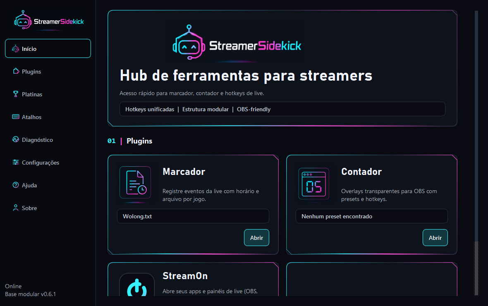
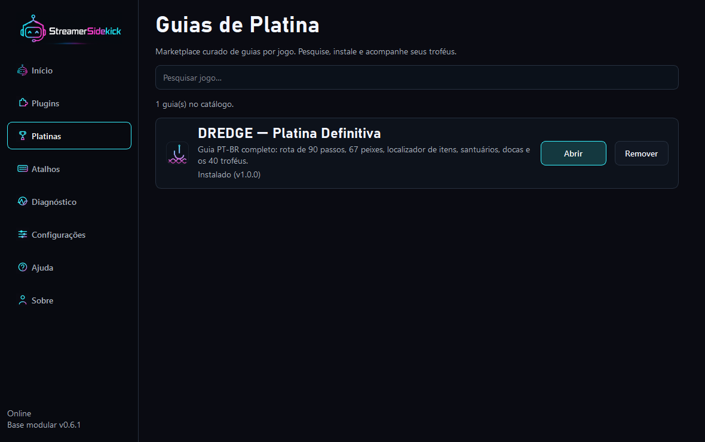
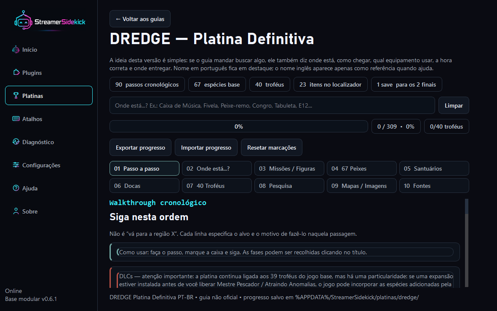
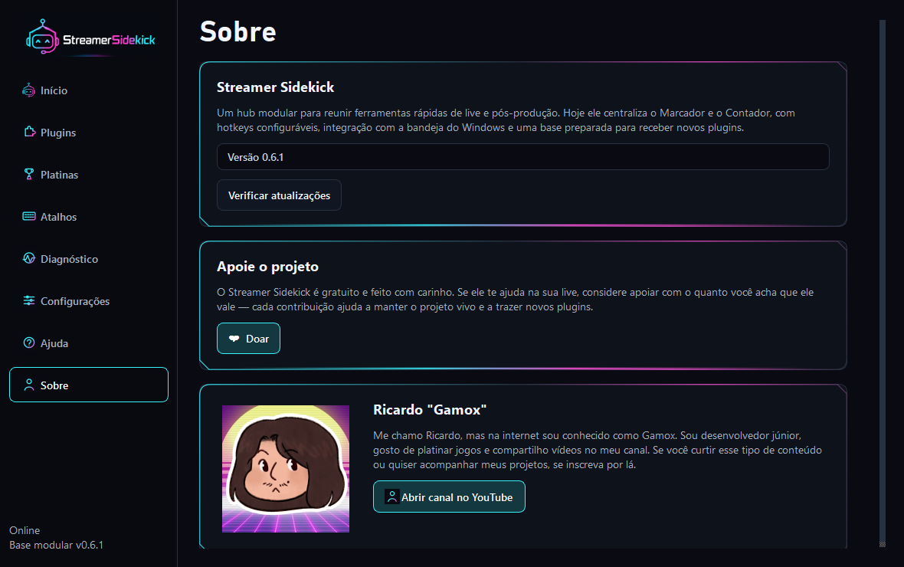

<p align="center">
  
</p>

<h1 align="center">Streamer Sidekick</h1>

<p align="center">
  Um hub desktop de ferramentas rápidas para a sua live — com sistema de plugins e guias de platina.
  <br>Windows e macOS.
</p>

<p align="center">
  <a href="https://github.com/ricardothezouro-debug/streamer_sidekick/releases/latest"><b>⬇️ Baixar</b></a>
  &nbsp;·&nbsp;
  <a href="PLUGIN_STANDARD.md">Criar plugins</a>
  &nbsp;·&nbsp;
  <a href="GUIA_DE_PLATINA.md">Criar guias de platina</a>
</p>

---

## ✨ Destaques

- 🏠 **Início** — um painel de verdade: lembrete de atualização, favoritos (até 4 ferramentas) e as últimas novidades puxadas do GitHub.
- 🧩 **Plugins** — marketplace dentro do app: instale ferramentas direto do GitHub, com um clique.
- 🏆 **Platinas** — guias de platina por jogo (checklist, dicas, imagens e progresso salvo), com busca — e cada guia pode abrir em uma janela separada.
- ⬆️ **Auto-update** — o app se atualiza sozinho no Windows e no macOS, com barra de progresso neon, sem janelas feias.
- 🎯 **Marcador & Contador** — anote eventos da live com horário e monte overlays transparentes pro OBS.
- ⌨️ **Hotkeys globais** — funcionam mesmo com o jogo em foco, com detecção de conflito.

## 📸 Telas

**Platinas — marketplace curado de guias**



**Um guia aberto (DREDGE) — direto no hub**



**Sobre**



## ⬇️ Baixar

### Windows

**➡️ [Baixe a versão mais recente na página de Releases](https://github.com/ricardothezouro-debug/streamer_sidekick/releases/latest)**

Baixe o `StreamerSidekick-*-portable.zip`, **extraia a pasta inteira** e execute o
`StreamerSidekick.exe`. Não precisa instalar nada — e o app se atualiza sozinho
quando sair uma versão nova.

### macOS

Baixe o `StreamerSidekick-*-macos.zip` na mesma
[página de Releases](https://github.com/ricardothezouro-debug/streamer_sidekick/releases/latest),
descompacte e arraste o `Streamer Sidekick.app` para Aplicativos. Ou monte da
fonte:

```bash
python3 -m venv .venv
source .venv/bin/activate
pip install -r requirements.txt -r requirements-build.txt
./scripts/build_app_macos.sh
```

O resultado é `dist/Streamer Sidekick.app`. Duas coisas específicas do Mac:

- **Permissão de Acessibilidade.** Sem ela o macOS não entrega eventos de teclado
  ao app: os atalhos globais são registrados mas nunca disparam. Vá em **Ajustes
  do Sistema → Privacidade e Segurança → Acessibilidade** e ligue o Streamer
  Sidekick. A aba **Diagnóstico** avisa quando a permissão está faltando.
- **Auto-update funciona, mas custa a permissão.** O app se atualiza sozinho no
  Mac também. Só que, como o `.app` não é assinado com uma conta de
  desenvolvedor Apple, o macOS trata cada versão como um app diferente e pede a
  Acessibilidade de novo depois de atualizar — o app avisa antes de aplicar.

Seus dados ficam em `~/Library/Application Support/StreamerSidekick/`.

## 🧩 Plugins

Na seção **Plugins** há um card **"+"** que abre o marketplace: os plugins vêm de
um catálogo curado (`plugins.json`) e são baixados direto do GitHub. Um plugin é
um repositório que expõe `module_info()` + `build_page()`.

Quer criar um? O padrão completo está em **[PLUGIN_STANDARD.md](PLUGIN_STANDARD.md)** —
feito para você (ou uma IA) seguir.

## 🏆 Platinas

A aba **Platinas** é um marketplace curado de **guias de platina por jogo**: cada
guia é um plugin (categoria `platina`) com checklist de troféus, dicas, imagens e
progresso salvo. Pesquise, instale e acompanhe seus troféus. Guias grandes podem
abrir em uma **janela separada** (botão "Abrir em janela"), para ficarem ao lado
do jogo enquanto você joga.

Para criar um guia, entregue a uma IA o **[GUIA_DE_PLATINA.md](GUIA_DE_PLATINA.md)**
(+ o `PLUGIN_STANDARD.md`) com os troféus do jogo — ela gera o guia completo.

## 🛠️ Para desenvolvedores

Rodar do código-fonte:

```powershell
.\.venv\Scripts\activate
python -m streamer_sidekick
```

```bash
# macOS / Linux
source .venv/bin/activate
python -m streamer_sidekick
```

Testes:

```bash
pip install -r requirements-dev.txt
pytest -q
```

Há também um smoke test que sobe o hub inteiro sem display (é o que pega os
bugs de plataforma — o CI roda no Windows **e** no macOS):

```bash
QT_QPA_PLATFORM=offscreen PYTHONPATH=src python scripts/smoke_test.py
```

Build do portable (também roda automático via GitHub Actions ao lançar):

```powershell
.\.venv\Scripts\python.exe -m pip install -r requirements-build.txt
.\scripts\build_exe.ps1
.\scripts\package_portable.ps1
```

O fluxo de release está em **[RELEASING.md](RELEASING.md)** — na prática: bump da
versão → PR para `main` → o CI builda e publica a Release sozinho.

## 📄 Licença

Streamer Sidekick é licenciado sob a **PolyForm Noncommercial License 1.0.0** —
livre para uso pessoal e não comercial. Revenda, redistribuição paga ou venda de
versões modificadas exigem permissão por escrito. Veja `LICENSE` e `NOTICE`.
